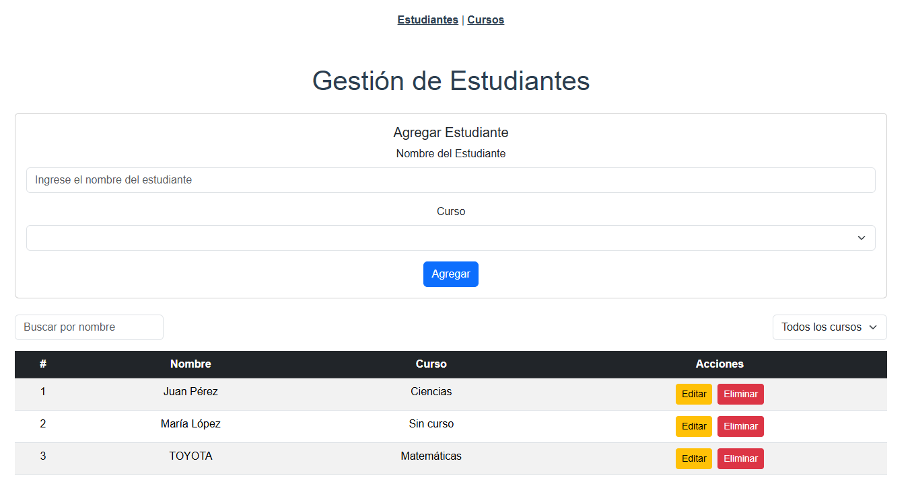

Proyecto de CRUD Estudiantes y Cursos

Este proyecto es un sistema CRUD (Crear, Leer, Actualizar, Eliminar) para manejar estudiantes y cursos.

Requisitos:
1. Tener instalada la última versión de Node.js.
   Verifica la versión con:
   ``` node -v ```

2. Tener instalado npm (Node Package Manager).
   Verifica la versión con:
   ``` npm -v ```

Instalación:
1. Instalar las dependencias del proyecto:
    ```  npm install ```

Ejecución:
 
1. Iniciar el servidor simulado con json-server:
   ```  npx json-server --watch db.json --port 3000 ```
   El backend simulado estará disponible en http://localhost:3000
2. Iniciar el servidor  
     ```  npm run serve  ```
   La aplicación se abrirá en http://localhost:8080

## Laboratorio 6




